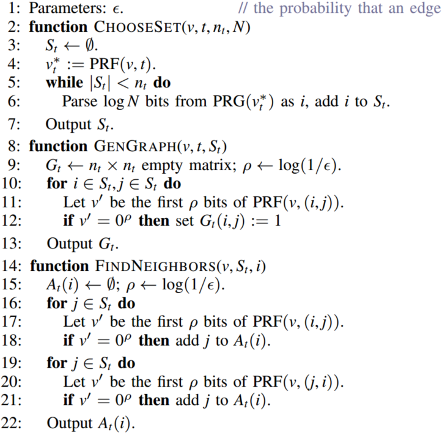
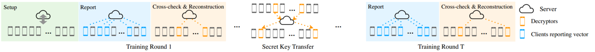
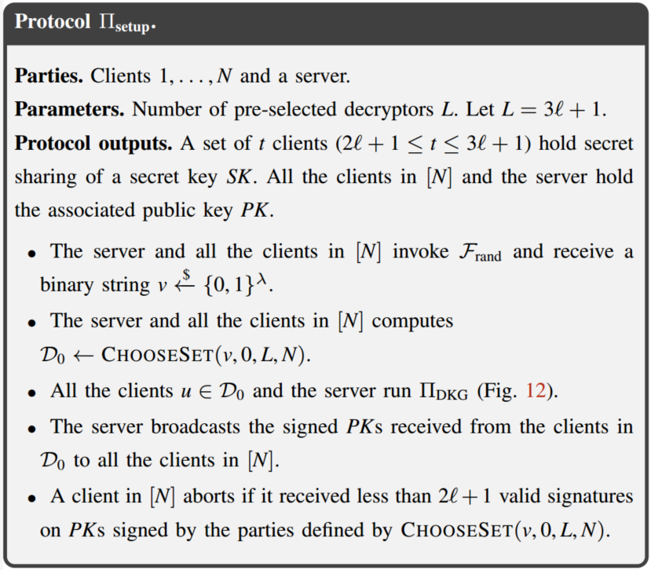
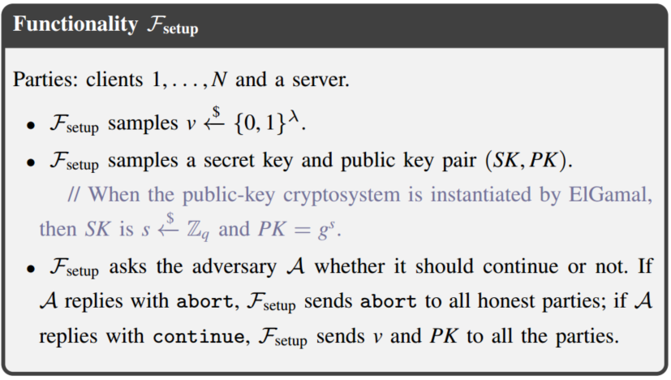
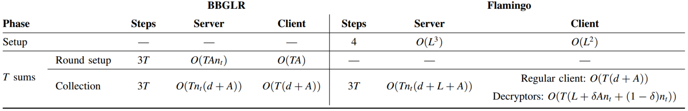
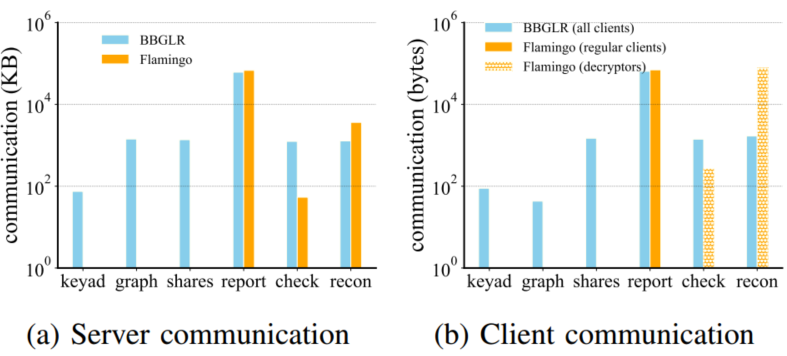
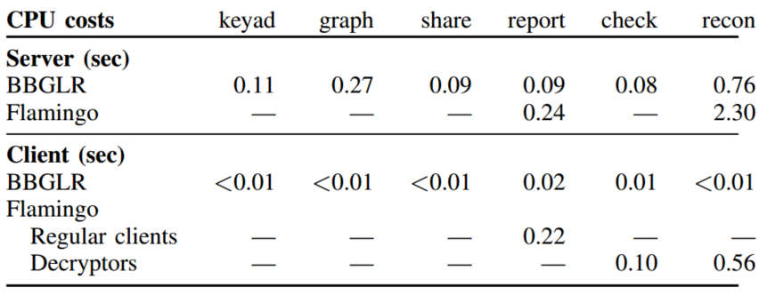
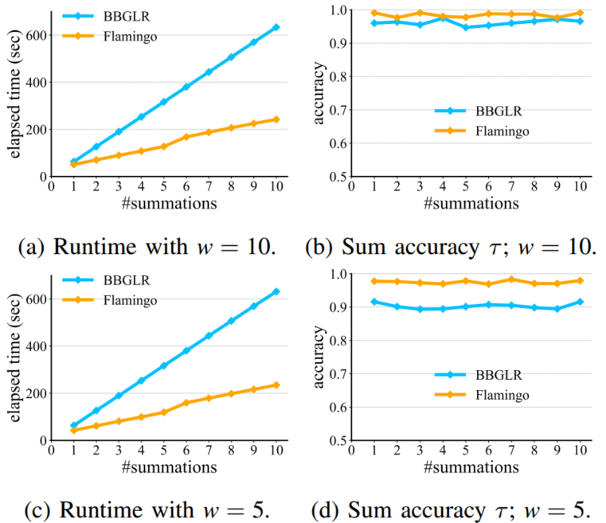
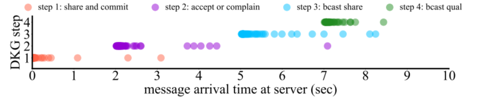
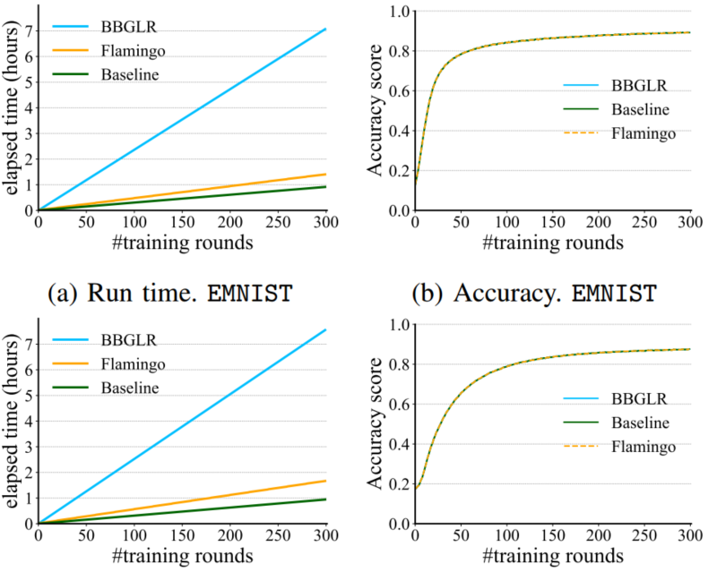

# Flamingo: Multi-Round Single-Server Secure Aggregation with Applications to Private Federated Learning

## 摘要
本文介绍了Flamingo，一个用于跨大型客户端安全聚合数据的系统。在安全聚合中，服务器对客户机的私有输入求和并获得结果，而不需要了解最终总和所暗示的任何关于单个输入的信息。Flamingo专注于在联邦学习中发现的多轮设置，其中执行许多模型权重的连续求和(平均)以获得一个好的模型。以前的协议，如Bell等人(CCS ' 20)，是为单轮设计的，并通过多次重复协议来适应联邦学习设置。Flamingo消除了以前协议的每轮设置的需要，并且有一个新的轻量级退出弹性协议，以确保如果客户端在一笔钱的中间离开，服务器仍然可以获得有意义的结果。此外，Flamingo引入了一种新的方式来本地选择Bell等人引入的所谓的客户端邻居。这些技术帮助Flamingo减少了客户端和服务器之间的交互次数，从而大大减少了完整训练会话的端到端运行时间。
我们实现并评估了Flamingo，并表明它可以在(扩展的)MNIST和CIFAR-100数据集上安全地训练神经网络，并且与非私有联邦学习系统相比，模型收敛而精度没有损失。

## 1.引言
已经提出了许多用于安全聚合的协议和系统，例如，在私有错误报告和统计收集的场景中[^5,12,20,24]。然而，由于其特定的模型，安全聚合面临着前所未有的挑战:大量客户端、高维输入向量(例如，模型权重)、模型收敛之前的多轮聚合以及不稳定的设备(例如，一些设备可能在完成协议之前脱机)。因此，以黑盒方式直接应用这些协议并仍然获得良好的保证和性能是困难的。
在模型的完整训练过程中多次使用BBGLR协议(或其变体)进行求和会产生很高的成本。具体来说，这些协议遵循这样的模式:在设置阶段让每个客户端与其他几个客户端建立与输入无关的秘密，然后在收集阶段使用这些秘密计算单个总和。由于隐私原因，这些秘密不能被重用。因此，对于训练过程中的每一轮聚合，都需要执行昂贵的新设置。此外，在设置和收集阶段的每个步骤(客户机-服务器往返)中，服务器必须与所有客户机进行交互。在联邦学习的设置中，这种交互的成本特别高，因为客户机可能在地理上分布，并且可能具有有限的计算和电池功率，或者具有不同的网络条件。
在本文中，我们提出了Flamingo，这是第一个单服务器安全聚合系统，它可以很好地进行多轮聚合，并且可以在严格的联邦学习设置中支持完整的训练会话。在高层次上，Flamingo引入了一次性设置和用于计算多个总和的收集过程，这样在设置中建立的秘密可以在整个收集过程中重用。对于收集过程中的每个求和，客户端使用从这些秘密派生的随机掩码掩盖其输入值(例如，在联邦学习中更新的权重向量)，然后发送掩码输入给服务器。服务器将所有掩码输入加起来，并通过所有掩码的总和得到最终的聚合值(服务器想要的)。然后Flamingo使用一种轻量级协议，通过少量随机选择的客户端(我们称之为解密器)与服务器交互以删除掩码。
与多次运行BBGLR相比，Flamingo的设计显著减少了联邦学习模型的总体训练时间。首先，Flamingo消除了对每次求和的设置阶段的需要，这减少了整个训练过程中的步骤数。其次，对于每个求和，Flamingo只有一个步骤，要求服务器联系所有客户端(请求他们的输入);其余的交互是在服务器和一些作为解密者的客户端之间执行的。
除了训练效率之外，客户只需要在一轮中交流一次，这一事实减少了模型对只包含来自功能强大、连接稳定的设备的数据的结果的偏差。在Flamingo中，服务器与客户端只交流一次以收集输入;相比之下，以前的工作在设置阶段(输入收集之前)有多个客户机-服务器交互步骤，因此过滤掉弱设备以进行汇总，因为保持更长时间可用是具有挑战性的。从另一个角度来看，如果我们确定客户端数量，客户端在给定步骤中的故障概率和网络条件，Flamingo的结果质量更高，因为它们是在比以前的工作更多的输入上计算的。
总之，Flamingo的技术创新是：
- 轻量的退出弹性。实现dropout弹性的新机制，其中服务器仅与少量客户端通信以删除掩码。所有其他客户都可以在提交输入后的第一步自由离开，而不会影响结果。
- 可重用的秘密。生成掩码的新方法，允许跨聚合轮重用秘密。
- 每轮图表。一个新的图生成过程，允许Flamingo的客户端单方面决定(没有服务器的帮助，就像之前的工作一样)他们应该在任何给定的回合中使用哪个成对的掩码。

## 2.问题陈述
安全聚合一个关键的应用是安全联邦学习，服务器希望在属于许多客户端的数据上训练模型，但客户端不希望共享他们的数据(或其他可能泄露数据的中间信息，如权重[^77])。为此，每个客户机从服务器接收原始模型，并根据自己的数据计算新的私有权重。然后，服务器和客户机参与一个安全聚合协议，该协议帮助服务器获得客户机私有权重的总和，而不需要了解任何关于单个权重的信息。然后，服务器对总和进行规范化，以获得代表模型新状态的平均权重。服务器重复这个过程，直到训练收敛。
这个过程形式化如下。设$[z]$表示整数$\{1,2,\cdots,z\}$，令$x$表示一个向量;对向量的所有操作都是组件式的。在培训开始前，总共有$N$个客户。每个客户端以$[N]$中的数字为索引。训练过程由$T$轮组成。在每一轮$t\in[t]$中，从$N$个客户中随机抽取一组客户，记为$S_t$。对于第$t$轮，每个客户$i \in S_t$都有一个输入向量$x_{i,t}$(客户可以在多轮中被选中，并且在每轮中可以有不同的输入)。在每一轮中，服务器想要安全地计算输入向量的和$\sum_{i \in S_t}x_{i,t}$。
在联邦学习的实际部署中，很难保证一个完整的总和，因为一些客户机可能会在聚合过程的中间退出，而服务器必须继续执行协议而不等待它们返回(否则服务器可能会被阻塞一段不可接受的时间)。所以真正的目标是从$S_t$的最大可能子集计算输入向量的和;我们将在接下来的几节中对此进行详细说明。

### 2.1 目标部署场景

根据最近对联邦学习部署的调查[^43]，常见的参数如下。$N$在$100K-10M$的范围内，其中$|S_t | = 50-5000$个客户被选中参加给定的一轮$t$。一个完整的训练阶段的总轮数$t$为$500 - 10000$。对于我们调查的数据集[^16,17]，输入权重$(x_i,t)$通常在$1K-500K$的量级上。这些系统中的客户端是具有不同程度可靠性的异构设备(例如，手机、服务器)，并且可能由于设备或网络故障而停止响应。
### 2.2 通信模型
每个客户机都通过一个私有的、经过身份验证的通道与服务器通信。从客户机发送到其他客户机的消息通过服务器转发，并进行端到端加密和身份验证。
### 2.3 威胁模型
**Dropouts**  在每一轮求和中，服务器与客户机(或它们的一个子集)进行多次交互(几个步骤)以计算求和。如果服务器在一个步骤中与一组客户端联系，其中一些客户端无法及时响应，服务器别无选择，只能继续进行;掉线者将被丢弃，并且不参与此回合求和的其余步骤。在实践中，该集合中退出的比例取决于客户端响应时间分布和服务器超时(例如，一秒);更长的超时意味着更低的退出率。
&emsp;&emsp;系统中有两种类型的客户端:提供输入的普通客户端和解密器，它们是特殊的客户端，其工作是帮助服务器恢复最终结果。我们将在任何给定的聚合轮中退出的常规客户端的比例上界为$\delta$，并将在任何给定的聚合轮中退出的解密器的比例上界为$\delta _D$。
**Adversary** 我们假设有一个静态的、恶意的对手，它破坏了服务器和$\eta$比例的$N$个客户端。也就是说，攻击者独立于协议执行而危及$N_{\eta}$个客户端，并且在整个执行过程中(即所有回合)损坏的集合保持不变。请注意，恶意客户端显然可以在协议执行期间选择退出，但为了使我们的安全定义和分析清晰，我们将恶意客户端的退出与诚实客户端的退出分开考虑。
**Threshold requirement** Flamingo的最低要求是$\delta_D+\eta_D < 1/3$。对于目标安全参数$κ$，我们在附录C中展示了如何为Flamingo选择其他参数以满足上述要求并使渐近代价最小。
**与之前作品的比较**。BBGLR和其他作品[^9,11]也有静态的恶意对手，但仅针对单轮聚合。事实上，在3.3节中，我们展示了他们的协议不能自然地扩展到多个聚合，以抵御恶意对手。
### 2.4 属性
Flamingo是一个安全聚合系统，在上述威胁和故障模型下实现了以下特性:我们在这里给出非正式的定义，并将正式的定义推迟到5.3节。
- $Dropout$ $resilience$:当各方都遵守协议时，服务器在每轮$t$中将获得$S_t$中所有在线客户端的输入之和。注意，这隐含地假设协议完成了所有轮询并输出有意义的结果。
- 安全性:对于$t$轮中$S_t$中的客户端输入求和，恶意攻击者从至少$(1−\delta−\eta)|S_t |$客户端学习输入的总和。
- 和的精度($Sum$ $accuracy$): 该轮最终的求和有一个和的精度$\tau$，如果最终和的结果包括了$\tau$比例的客户端被选择贡献该轮。

## 3. 背景
在本节中，我们将讨论BBGLR[^9]，它是联邦学习设置中用于单轮安全聚合的最新协议。我们从这个协议中借鉴了一些想法，但是为了支持完整的训练课程，我们对Flamingo的设计完全不同。
### 3.1 BBGLR协议
BBGLR是为计算一组客户机输入的单个总和而设计的。为了将其应用于联邦学习设置，我们可以简单地假设在给定的训练过程中，有$n$个客户端从大小为$N$的大群体中选择，然后我们可以在这$n$个客户端上运行BBGLR来计算它们的输入之和。
BBGLR的高级思想是让客户端获得成对随机掩码，并以这样的方式将这些掩码添加到它们的输入向量中，当所有客户端的所有掩码输入向量都被添加时，掩码会被抵消。它由设置阶段和收集阶段组成。首先在下面描述一个半诚实的版本。
**Setup phase**  设置阶段包括三个步骤:(1)创建包含所有$n$个客户端的公钥的数据库;(2)创建一个无向图，其中每个顶点都是客户端，并且每个顶点都有足够的边来满足某些属性;(3)让每个客户端向图中的邻居发送两个秘密的共享。
在第一步中，每个客户端$i\in[n]$生成一个秘密$a_i$，并将$g ^{a_i}$发送给服务器，其中$g^{a_i}$表示客户端$i$的公钥。然后，服务器将这些公钥存储在数据库中。请注意，BBGLR的恶意安全版本要求服务器在此特定步骤中是半诚实的，或者存在可信的公钥基础设施(PKI)。第二步，按照如下方式建图。每个客户端$i\in[n]$随机选择$[n]$中的$\gamma$个其他客户端作为其邻居，并告诉服务器它们的选择。在服务器收集了所有客户机的选择之后，它通知每个客户机它们在$[n]$中的邻居索引和公钥。客户端$i$的邻居记为$A(i)$，是与$i$有边的顶点对应的邻居(即我选择了它们或者它们选择了$i$)。最后，每个客户端$i$使用$Shamir$的秘密共享向其邻居$A(i)$共享$a_i$和一个额外的随机值$m_i$(设阈值为$\mathbin{l} < |A(i)|$)，其中共享使用安全认证的加密方案进行端到端加密，并且通过服务器为中介发送。
**Collection phase** 客户端$i$向服务器发送以下掩码向量:
$$Vec_i=\overrightarrow{x_i}+\underbrace{\sum_{j \in A(i),i<j}PRG(r_{i,j})-\sum_{j \in A(i),i>j}PRG(r_{i,j})}_{pairwise \ mask}+\underbrace{PRG(m_i)}_{individual\ mask}$$
其中，$r_{i,j}=g^{a_ia_j}$，它可以由客户端$i$计算，因为它拥有秘密$a_i$和$j$的公钥$g^{a_j}$。(这些本质上是客户端与其邻居之间的Diffie-Hellman密钥交换。)这里，我们将PRG的输出视为整数向量，而不是二进制字符串。此外，为了便于标记，我们将成对掩码项写成$\sum_{j \in A(i)}\pm PRG(r_{i,j})$。
然后，服务器将接收到的所有向量求和，从而产生一个包含掩码和的向量。为了恢复正确的总和，服务器需要一种移除掩码的方法。它通过向每个离线客户端$i$请求从$i$的邻居那里获得$a_i$的份额;对于每个在线客户机$j$, 从$j$的邻居那里获得$m_j$的份额。这些共享允许服务器为每个客户端重构成对掩码或单个掩码。只要发送请求的共享的邻居数大于$l$，服务器就可以成功地移除掩码并获得总和。这就给出了BBGLR的dropout弹性特性。
为了说明有$m_i$的必要性，假设没有添加它，即$Vec_i = x_i + PRG(r_{ij})$。假设客户端$i$的消息发送了，但没有及时收到。因此，服务器重建$i$的成对掩码$PRG(r_{i,j})$。然后，$i$的向量$Vec_i$到达服务器，服务器可以减去单个掩码从而恢复$x_i$，私有掩码可以防止这种情况。
**Preventing attacks in fault recovery**上述协议仅在半诚实设置下有效。恶意攻击者可以进行两种主要攻击。首先，恶意服务器可以向诚实的客户端提供不一致的退出信息，并恢复成对和单独的掩码。例如，假设客户端$i$有邻居$j_1，…，j_{\gamma}$，并且恶意服务器对$j_1，…，j_{\gamma}$说谎邻居$j_1，…，j_{\gamma}$已经退出(当他们实际上没有)。作为响应，它们的邻居包括$i$，将向服务器提供重建$a_{j1},\cdots,a_{j_{\gamma}}$所需的信息。从而推导出所有的成对掩码$r_{i,j_1},\cdots,r_{i,j_\gamma}$。同时，服务器可以告诉$j_1，…，j_{\gamma}$客户端$i$在线并且请求$m_i$的分享。此时服务器知道客户端$i$的成对掩码和私有掩码，从而侵犯$i$的隐私。为了防止这种情况，BBGLR在每个客户端的所有邻居之间执行一致性检查步骤，以就哪些节点实际退出达成一致。在这种情况下，客户端$i$就知道没有一个邻居退出，并且会拒绝提供他们成对掩码的分享。
其次，恶意客户机可以提交从邻居接收到的共享不同的共享。这可能导致服务器上的重建失败，或者服务器派生出完全不同的秘密。BBGLR通过让客户端散列他们的秘密并在发送输入向量时将这些散列发送给服务器来解决后一个问题;但是，由于错误纠正中的阈值不足，重构仍然可能失败1。总而言之，抵御恶意攻击的BBGLR完整协议(假设在设置过程中存在PKI或受信任的服务器)总共有六个步骤:三个步骤用于设置，三个步骤用于计算总和。
BBGLR对一轮训练效果很好，但不适用于多轮训练。首先，联邦学习中选择参与一轮的客户端集合发生了变化，因此需要派生出新的图和共享新的秘密。在协议的第一步，它要么需要一个半诚实的服务器，要么需要PKI，如果假设前者，意味着对手必须在每轮设置中的确切时间内保持半诚实，这几乎不可能保证。如果使用PKI，任何密钥都不能被重用；因此，每一轮都需要更新PKI中的所有密钥，这非常昂贵
## 4. 高效的多轮安全聚合
Flamingo支持多轮聚合，而无需为每轮重新设置，并且可以在整个过程中抵御恶意对手。所需的假设是:(1)在设置中，所有各方都从可信来源(例如，分布式随机信标[^25])获得相同的随机种子;(2) PKI(例如，密钥透明度日志[^21,41])。下面我们描述支撑Flamingo(4.1)的高级思想，然后我们给出完整的协议(4.3和4.4)。

### 4.1 主要思想
(1) **轻量级的掉线弹性**。我们没有要求客户端与所有邻居秘密共享掩码的$a_i$和$m_i$，而是让每个客户端以一种特殊的方式加密它们成对的和单独的掩码的PRG种子，将得到的密文附加到它们的掩码输入向量上，并在一个步骤中将它们提交给服务器。然后，在我们称为解密器的一组特殊的$L$个客户机的帮助下，服务器可以解密与每个屏蔽输入向量相关的两个种子中的一个，但不能同时解密两个种子。实际上，这实现了与BBGLR(3.1)类似的容错特性，但采用了不同的机制。
启用此新协议的关键构建块是阈值解密[^28,32]，其中客户端可以使用系统范围内已知的公钥$PK$加密数据，这样一来，产生的密文只能使用密钥$SK$解密，该密钥在Flamingo中的解密器之间共享。这种机制不仅对系统中的每一方都隐藏了完整的秘密密钥，而且解密者可以在无需相互交互的情况下解密密文。具体来说，Flamingo中的服务器将密文(从提交的向量中提取)发送给每个解密器，从$L$个解密器中获得阈值$l$个响应，并在本地组合$l$个响应从而产生相应的明文。我们的阈值解密实例化是基于ElGamal密码系统和Shamir的秘密共享。
在设计此协议时，我们必须克服的一个关键技术挑战是弄清楚如何在解密器之间秘密共享密钥$SK$。据我们所知，现有的高效分布式密钥生成(DKG)协议[^18,33]假设一个广播通道或可靠的点对点通道，而我们的通信模型是星形拓扑，其中所有消息都由一个潜在的对手(控制服务器)代理，可以丢弃它们。也有异步DKG协议[^3,26]，但标准异步通信模型假设消息最终交付，而在我们的设置中并非如此。事实上，我们可以放宽DKG的保证，第4.3节给出了在星形拓扑通信模型中工作的基于离散日志的DKG协议的扩展[^33]。
总而言之，上述方法通过两个步骤为单个求和提供了一个drop- resilient协议：首先，每个客户端发送其掩码向量和PRG种子的密文;其次，服务器使用分布式解密来恢复退出客户端的种子(和掩码)。这种设计改进了BBGLR的运行时间，因为它不需要让所有客户端都来删除掩码——服务器只需要等待，直到它从解密器收集到足够的共享，而不用等待几乎所有共享都到达。此外，将几个小密文(每个64 bytes)附加到一个大的输入向量(数百kb)的通信开销是很小的。
(2) **可重用的秘密** Flamingo的目标是消除每一轮聚合的设置阶段。在讨论Flamingo的方法之前，请考虑一下，如果我们在BBGLR中简单地运行一次设置阶段，然后多次运行收集过程，会发生什么情况。首先，我们立即被限制在同一组客户端上执行所有聚合任务，因为BBGLR在设置阶段建立了邻居图。这是有问题的，因为联邦学习通常为每一轮聚合选择不同的客户端集。其次，客户的输入会被揭露。假设客户端$i$在第1轮退出，但在第2轮没有退出。在第1轮中，服务器重构$r_{i,j}, j \in A(i)$以揭开总和的掩码。在第2轮，客户端$i$发送 $\overrightarrow{x_i}+\sum_{j \in A(i)}\pm PRG(r_{i,j})+PRG(m_i)$，服务器请求$i$的邻居获得它们的份额来重建$m_i$，由于所有的$r_{i,j}$都在第1轮被重构，并在第2轮被重用，因此服务器可以派生这两个掩码从而保护$\overrightarrow{x_i}$。
Flamingo将$r_{i,j}$视为一个长期的秘密，并让客户应用$PRF$为每个成对的掩码生成一个新的种子。具体来说，客户端$i$计算第$t$轮成对掩码的$PRG$种子为$h_{i,j,t}= PRF(r_{i,j},t)$对于所有$j \in A(i)$。请注意，客户机$j$将计算相同的$h_{i,j,t}$，因为它与$i$在$r_{i,j}$上一致。此外，每个客户端还为第$t$轮中的私有掩码生成一个新的种子$m_{it}$。因此，结合思路(1)，每个客户端使用$PK$对每轮的种子$\{h{i,j,t}\}_{j\in A(i)}$和$m_{i,t}$进行加密。然后，服务器为每个客户端恢复两个掩码中的一个。我们稍后描述了一个优化，其中客户端不使用PK加密$m_{i,t}$(4.4)。$r_{i,j}$作为一个长期秘密的一个很好的特性是Flamingo可以避免在图邻居之间执行所有的Diffie-Hellman密钥交换(通过服务器代理)。Flamingo依赖于外部PKI或可验证的公钥目录，如CONIKS[53]及其后续版本(它们是引导端到端加密系统的常见构建块)。
(3) **每轮生成图** 出于效率原因，BBGLR使用稀疏图而不是全连接图(否则每个客户端都需要与每个客户端秘密共享其种子)。Flamingo引入了一种新的方法来建立与$\gamma$无关的通信代价图。每轮$t$的图是由所有参与者都知道的随机字符串$v \in \{0,1\}^{\lambda}$生成的(从随机信标或可信设置中获得)。图1列出了该过程。CHOOSESET($v,t, n_t,N$)确定第$t$轮所涉及的客户集，即规模为$n_t$的$St \subseteq N$。服务器计算$G_t\leftarrow GENGRAPH(v,t, S_t)$作为$S_t$中客户端之间第t轮的图。客户端$i \in S_t$可以在$G_t$中找到它的邻居，而不用使用$FINDNEIGHBORS(v, S_t,i)$物化整个图。这样，$i$的邻居就可以在本地生成。我们选择一个合适的$λ$，使得在每一轮中，图都是高概率连接的。

</img>

上述想法结合在一起消除了对每轮设置的需求，从而提高了BBGLR上多轮聚合的总体运行时间。图2描述了整个协议，接下来的部分描述了每个部分。

</img>

### 4.2 PKI中密钥的类型
PKI为$[N]$中的所有客户端存储三种类型的密钥:
- 客户端$i$的DH公钥$g^{a_i}$，对应私钥$a_i$，为了客户端$j$派生出秘密$r_{i,j}$通过计算$(g^{a_j})^{a_i}$。
- 客户端$i$的$g_{b_i}$为了派生出一个对称加密密钥$k_{i,j}$用于认证加密方案SymAuthEnc；当一个客户端通过服务器向另一个客户端发送消息时使用此方案。当客户端$i$向$j$发送消息时，都隐式地表示其使用$k_{i,j}$进行加密。
- 客户端$i$的$pk_i$用于验证对$sk_i$签名消息的签名。
  
### 4.3 Setup phase
设置阶段由两部分组成:(1)向所有参与者分发随机种子$v \in \{0,1\}^{\lambda}$，以及(2)随机选择客户端子集作为解密器并分发非对称加密方案AsymEnc的秘钥共享。在我们的上下文中，AsymEnc是ElGamal密码系统的加密函数。第一部分可以通过可信的随机性来源来完成，或者通过利用已经部署的随机性信标来完成，比如Cloudflare的[^1]。第二部分可以通过使用随机种子$v$ (CHOOSESET)选择一组$L$客户机作为解密器$D$来完成，然后在它们之间运行DKG协议。我们使用基于离散对数的DKG协议[^33] (称之为GJKR-DKG)，因为它与ElGamal密码系统兼容。然而，这个DKG不能在我们的通信模型下工作，需要进行一些更改和放松，我们将在下面讨论。

**DKG with an untrusted proxy** 我们首先简要介绍GJKR-DKG协议。它的阈值是1/2，也就是说一半的参与者可以不诚实的。其余必须正确执行以下步骤:(1)每一方$i$生成一个随机值$s_i$，并作为经销商分配$s_i$的股份($j$方获得$s_{i,j}$)。(2)每方$j$验证收到的股份(详见论文)。如果$i$方的份额未通过验证，$j$方广播对$i$方的投诉。(3)对于$j$方的每一项投诉，$i$方广播$s_{i,j}$进行验证。(四)对验证不合格的，各方取消其资格;其余各方形成一个固定的QUAL集合。然后，各方对来自QUAL的共享进行汇总，得到一个共享的密钥。
本文对GJKR-DKG做了一些修改，首先，假设不诚实参与者的阈值是1/3。其次，所有的消息都是签名的；诚实的当事人如果没有收到规定的信息就会放弃。第三，我们在每个客户端决定最终的QUAL集合之前增加了一个步骤:所有各方对他们的QUAL集合签名并将其发送给服务器；服务器将签名的QUALs发送给各方。然后，每一方检查它是否接收到$2(l + 1)$或更多相同的有效签名QUAL集。如果是，那么QUAL集合定义一个秘密密钥;否则各方终止协议。GJKR-DKG的方便之处是我们允许各方中止(因此最后不会共享密钥)，这在联邦学习设置中是合理的，因为如果服务器行为不当，将无法获得结果。
**Decryptors run DKG** 在DKG结束时，选定的解密器的一个子集将持有密钥$SK$的共享。生成的$PK$由解密器签名，并由服务器发送给所有$N$个客户端;签名可以防止服务器分发不同的公钥或分发由一组恶意客户端生成的公钥。每个客户端检查它是否从随机种子(来自信标)确定的解密器集合中收到了$2l + 1$个有效的签名$PKs$;否则，客户端中止。
### 4.4 Collection phase
收集阶段包括$T$轮，每一轮$t$有三步：report,cross-check,reconstruction。
**Report** 在$t$轮中，服务器随机值$v$(从setup阶段获得)选择客户端集合$S_t \subseteq [N]$，大小$n_t$。然后建客户端之间的图。服务器向每个客户端$i \subseteq S_t$请求发送一个包括以下三个信息的消息：
1\) $Vec_i=\overrightarrow{x_{i,t}}+\sum_{j \in A_t(i)} \pm PRG(h_{i,j,t})+PRG(m_{i,t})$，其中$h_{i,j,t}=PRF(r_{i,j},t), r_{i,j}=(g^{a_i})^{a_j}$，$m_{it}$是是客户端在第$t$轮由客户端$i$新生成的。
2\)$L$个对称加密密文：$SymAuthEnc(k_{i,u},m_{i,u,t}),\ u \in D$，其中$m_{i,u,t}$是与$u$之间$m_{i,t}$的分享，$k_{i,u}$是在客户端$i$和解密器$u$之间共享的对称加密密钥(可以由PKI派生$k_{i,u}$)。
3\) $|A_t(i)|$个ElGamal 密文：AsymEnc($PK,h_{i,j,t}$)，对于所有$j \in A(i)$。
上述对单个掩码使用对称加密，对成对掩码使用公钥加密的方法是为了在实践中平衡计算和通信。
**Cross-check**  服务器需要恢复在线客户端的$m_{i,t}$和退出客户端的$h_{i,j,t}$。为此，服务器将客户端标记为“离线”或“在线”，并要求解密器恢复相应的掩码。对于BBGLR，我们描述了该步骤在故障恢复过程中如何涉及大多数客户端，并强调了一个问题，即恶意服务器可以向客户端发送不一致的标签，并为某些目标客户端恢复成对掩码和单个掩码(3.2)。Flamingo还需要处理这种类型的攻击(服务器告诉一些诚实的解密者解密$m_{it}$，并告诉其他诚实的解密者解密$h_{i,j,t}$，并利用恶意的解密者重建两者)，但它只需要涉及解密者。详细地说，每个解密者对nt客户机的在线/离线标签进行签名(每个客户机只能标记为离线或在线)，并将它们发送给其他解密者(通过服务器)。每一个解密器检查是否收到了$2L/3$或更多有效的签名标签($\delta_D+\eta_D < 1/3$)。如果是，每个解密器进一步检查：
1\) 在线的客户端数量至少为$(1-\delta)n_t$;
2\) 图中所有在线客户端都是连通的;
3\) 每个在线客户端$i$至少有$k$个在线邻居，使得$η^k < 2^{−κ}$(η和κ的定义见2.3)。
如果上述任何检查失败，解密程序将终止。此步骤确保所有诚实的解密者同意有效的离线/在线标签分配，从而服务器获得结果，或者诚实的解密器中止，服务器什么也得不到。
**Reconstruction** 服务器收集所有需要解密的密文:在线客户端的密文$m_{i,u,t}$(对称加密)，离线客户端的密文$h_{i,j,t}$(公钥加密)。然后，服务器将密文发送给所有的解密器，这些解密器根据他们商定的标签执行对称解密或阈值ElGamal解密。选择使用解密器来检查图并重建所有秘密是基于联邦学习中的一个重要观察:一轮中涉及的客户端数量$n_t$远小于输入向量长度[43]。因此，解密器的渐近代价(与$n_t$成正比)实际上小于输入权向量的大小。
### 4.5 跨回合恶意标记
由恶意攻击者控制的服务器可以要求对第$t$轮中的$h_{i,j,t}$进行解密，然后在另一个第$t'$轮中，服务器可以要求对$m_{i,t}$进行解密(而不是$m_{i,t'}$但如果服务器不关心在第$t'$轮中获得结果)。这允许服务器在清晰的情况下恢复$\overrightarrow{x_{i,t}}$。为了防止这种攻击，诚实的解密者需要知道发送密文的那一轮。对于对称密文，客户端将轮数$t$附加到明文(例如$m{i,u,t} ||t$)并使用经过认证的加密;对于公钥密文，客户端在密文$c$后面加上$t$，并对元组$(c,t)$签名(验证密钥在PKI中)。请注意，恶意的攻击者仍然可以欺骗足够多的诚实的解密器使它认为现在是第$t$轮，而实际上它是$t '$轮。为了防止这种情况，解密器还在在线/离线标签中包含轮数$t$并对其进行签名。交叉检查(4.4)保证解密器在轮数上达成一致。
### 4.6 解密器之间的负载均衡
在每次求和中，不是解密者的客户机只发送一个向量。这几乎是最优的即使聚合是非私有的，客户机也必须发送向量(但没有额外的小密文)。然而，解密器有额外的计算和通信为了帮助重建结果。这将导致系统中的负载不平衡，并且可能是不公平的，因为选择作为解密器的客户机必须比常规客户机做更多的工作。
在Flamingo中，解密器的职责随着时间的推移而变化。每R轮，当前的解密器将他们的$SK$份额转移给一组随机选择的新客户端，这些客户端作为新的解密器。为了确保安全，必须在转换过程中以特定的方式修改$SK$的份额，否则攻击者可能会在转换前控制一些恶意解密器，在转换后控制一些恶意解密器，从而获得足够的份额来重构$SK$。我们通过依赖先前的主动秘密共享技术来解决这个问题[^32,40];它们还使Flamingo能够根据需要更改解密器的数量和阈值。
最后的澄清是，在一轮中退出的解密器(例如，由于断电)可以稍后回来并参加另一轮(例如，当电源恢复时)。解密总是成功的，因为我们要求在任何步骤中都少于 $1/3$ 的解密器被丢弃或恶意(5)。密匙转换纯粹是为了系统负载平衡——退出弹性和安全性都不依赖于参数$R$。
## 5. 参数选择与安全性分析
Flamingo的参数包括：
- 系统参数$N,T$和在第$t \in[T]$轮中被选择客户端的数量$n_t$。
- 威胁模型参数$\delta_D, \delta, \eta$，$\eta_{S_t}, \eta_D$的关系依赖于$\eta$，在2.3中给出。
- 安全参数$\kappa$以及与安全有关的参数：图生成参数$\epsilon$和被选择解密器的数量$L$
### 5.1 设置阶段的安全性
设$\delta_D$为设置阶段解密器掉线比例的上界，Flamingo的DKG需要满足$\delta_D+\eta_D < 1/3$。注意$\eta_D$实际上取决于$\eta,L$和$N$，但是我们将使用$\delta_D$给出定理并讨论如何选择$L$来保证一个理想的$\eta_D$在附录C。
**Theorem 1** (Security of setup phase). 假设存在PKI和可信的随机源，并且DDH假设成立，设设置阶段解密器的掉线率上界为$\delta_D$。如果$\delta_D+\eta_D<1/3$，在2.2定义的通信模型下，在恶意对数控制服务器和$N$客户端中$\eta$比例的情况下协议$\prod_{setup}$(Fig 3)安全地实现功能$\mathcal{F}_{setup}$(Fig 4)。

</img>

 

</img>

### 5.2 收集阶段的安全性
首先，我们需要保证每个图$G_t$，即使在移除$δ + η$比例的掉线和恶意客户端对应的顶点后，仍然是连通的。这对$\epsilon$提出了一个要求，在引理1中说明。为简单起见，我们省略了$\epsilon$下界的确切公式，并将细节推迟到附录C。
**Lamma1** (图连通性) 给定安全参数$\kappa$和威胁模型参数$\delta,\eta$。设$G$是一个随即图$G(n,\epsilon)$。设$\mathcal{C},\mathcal{O}$是G中的两个随机节点子集，当$|\mathcal{O}| < \delta n$和$|\mathcal{C}|< \eta n$($\mathcal{O}$代表掉线集合且$\mathcal{C}$代表恶意集合)。设$\widetilde{G}$是由$\mathcal{C}$和$\mathcal{O}$中相连的边从$G$中移除后的图。存在$\epsilon^ *$对于所有$\epsilon \geq \epsilon^ *$，$\widetilde{G}$以$2^{-\kappa}$的概率连接。
其次，我们要求$2\delta_D +\eta_D < 1/3$，以确保所有在线诚实解密器在交叉检查步骤中达成一致，重构成功。请注意，在设置阶段退出($\delta_D$)的解密者将没有$SK$的份额;而在收集阶段一轮中那些掉线的用户($\delta_D$)可以另一轮中返回，因此我们有上述不等式。

## 6. 实现
本文用1.7行实现Flamingo和1.1K行实现了BBGLR。对于PRG，在计数器模式下使用AES，对于身份认证加密，使用AES-GCM，签名使用曲线上P-256上的ECDSA。代码可在https://github.com/eniac/flamingo.获得。
**分布式加密** 我们使用$ElGamal$加密来实例化非对称加密，它由三种算法组成(AsymGen,AsymEnc,AsymDec)。AsymGen输出一个私钥和公钥对$SK \in_{R} \mathbb{Z_q}$和$PK: =g^{SK} \in \mathbb{G}$。AsymEnc以$PK$和明文$h \in \mathbb{G}$为输入，输出密文$(c_0,c_1) := (g^w,h\cdot PK^w)$，其中$w \in_R \mathbb{Z_q}$是加密随机性冗余。AsymDec以$SK$和密文$(c_0,c_1)$为输入并输出$h = (c_0^{SK})^{-1}\cdot c_1$。
在阈值加密中，密钥$SK$在$L$方之间进行分享使得每一个$u \in[L]$持有秘密$s_u$，但没有单个实知道$SK$，即$(s_1,\cdots,s_L) \leftarrow Share(SK,l,L)$。假设$Alice$想要使共享密钥$SK$解密密文$(c_0,c_1)$。$Alice$发送$c_0$给每一方，并且获得$c_0^{s_u}$,$u \in U \subseteq{L}$。如果$|U| > l$，$Alice$可以从$U$中计算一组组合系数$\{\beta\}_{\beta_u}$。
$$c_0^{SK}=\prod_{u \in U}(c_0^{s_u})^{\beta_u}$$
给定$c_0^{s_k}$，$Alice$可以获得明文$h=(c_0^{SK})^{-1}\cdot c_1$。该协议的三个关键是：1) SK永远不会被重建； 2) 解密具有掉线弹性(只要有超过$l$个参与方相应就可以获得$h$)； 3) 非交互式：$Alice$与各方只交互一次。
在椭圆曲线群$\mathbb{G}$上实现了$Elgamal$并且使用曲线P-256。为了将二进制字符串$PRF(r_{i,j},t)$的输出映射到$\mathbb{G}$，我们先用IETF草案[^39]中的$hash-to-field$算法将其散列到曲线中的一个字段元素。然后使用$\mathbf{SSWU}$算法将字段元素映射到一个曲线点$P \in \mathbb{G}$。客户端使用ElGamal加密$P$然后使用SHA256对$P$进行哈希获得$h_{i,j,t}$——成对掩码的输入。当服务器解密ElGamal密文得到$P$时，它对$P$使用SHA256得到相同的$h_{i,j,t}$。
**优化** 在Flamingo's的重建步骤中，让服务器使用部分共享进行重建。也就是说，如果插值阈值是15，而服务器从20个解密器中收集了20分享，那么它将只使用其中的15个，忽略其余的5个共享。此外，我们只有一组解密器集合，当服务器收集到来自$U,U\subseteq U$的股份分享时，它从$U$中计算一组插值系数并且以此对所有分享进行线性组合。所有股份的线性组合可以并行完成。相比之下，BBGLR要求服务器计算不同的插值系数集来重建成对掩码(每个客户端一组)。
**仿真框架** 我们将所有Flamingo的代码集成到ABIDES[^14]，ABIDES是一个开源的高保真模拟器，专为金融市场的人工智能研究而设计。ABIDES非常适合因为它支持成千上万的客户端与服务器交互以促进事务(计算总和)。它还支持可配置的成对网络延迟。

## 7. 渐近的成本
与BBGLR相比，Flamingo的一个优势是它需要更少的往返计算。BBGLR一次求和需要六次往返;相比之下，Flamingo需要三个步骤:报告步骤涉及一轮中所有选择的客户端，其余两个步骤由服务器与解密器联系。与此同时，往返次数对聚合的整体运行时有显著影响，我们将在第8.2节中进行实验。造成这种情况的原因有两个方面:(1)广域网上RTT的延迟在几十毫秒左右;(2)服务器必须在每一步中等待足够的客户端发送消息，因此尾部延迟起着很大的作用。根据设置的不同，客户机消息到达的差异可能很大，有些客户机可能是低速网络上的移动设备。除了往返次数减少之外，预计Flamingo在重建阶段等待的时间也会减少。这是因为BBGLR中的服务器必须等待绝大多数客户端响应才能为退出客户端重建秘密，而Flamingo中的服务器只需要来自1/3的解密者的响应。
**客户端和服务器成本** 图5比较了Flamingo与BBGLR的通信成本。总之，BBGLR和Flamingo的$T$聚合轮总渐近代价变化不大;但是往返次数的数量差别很大。计算成本分析如下:在设置阶段，如果客户端是一个解密器，那么它对于DKG和密钥传输都有$O(L^2)$的计算复杂度。在第$t$轮的收集阶段，每个客户端计算$O(A+L)$次加密(假设对于所有客户端$i, A(i)≤A$)。如果客户端是解密器，它额外有$O(δ An_t +(1−δ)nt + ϵn_t^2)$计算成本。

</img>

## 8. 实验评估
在本节中，我们将回答以下问题:
- Flamingo的具体服务器和客户端成本是什么，以及Flamingo完成一轮和多轮聚合需要多长时间?
- Flamingo能训练一个现实的神经网络吗?
- 在结果质量和运行时间方面，Flamingo与最先进的技术相比如何?
我们实现以下基线:非私有基线。我们实现了一个服务器，它简单地汇总从客户机接收到的输入。在特定的一轮中，每个客户端向服务器发送一个向量。这些向量是明确的，并且可以是任何类型的值(例如浮点数)，不像Flamingo，它要求数据是掩码的正整数。与Flamingo一样，服务器可以容忍退出，并且只聚合来自超时前响应的客户端的向量。
**BBGLR**。对于BGGLR，我们在他们的论文[^9]中实现了算法3，尽管这可能会引入安全问题(即，我们使该基线的性能比现实中的性能更好，即使这意味着它不再安全)，但略有变化，从而显着提高了BBGLR的运行时间。我们的具体变化是，我们允许客户在建立图的过程中退出，简单地与及时响应的客户构建一个图。BBGLR(最初)要求在图建立过程中没有客户端退出，以确保图是连通的。如果不进行此修改，BBGLR的服务器必须等待所有客户机响应，并受到客户机响应分布的长尾的严重影响——这使得我们的实验花费了不合理的时间。
### 8.1 实验环境
先前的工作将评估重点放在服务器的成本上。虽然这是一个重要的方面(我们也会对其进行评估)，但是影响聚合(以及联邦学习训练)端到端完成时间的一个关键因素是客户机和服务器之间的通信往返次数。对于地理分布的客户端尤其如此。为了忠实地评估真实的网络条件，我们在一台具有40个Intel Xeon E5-2660 v3 (2.60GHz) cpu和200 GB DDR4内存的服务器上运行ABIDES模拟器[^14]。在实践中，客户端设备通常不如实验机强大。ABIDES支持立方网络延迟模型[37]:延迟包括一个基本延迟(一个范围)，加上一个控制在给定时间内到达的消息百分比的抖动(即延迟分布尾部的形状)。我们将基本延迟设置为ABIDES默认参数中的“全局”设置(范围为21微秒到53毫秒)，并使用默认参数进行抖动。
Flamingo和BBGLR都是按步骤工作的(如2.3所定义)。我们为协议的每一步定义一个等待期。在等待期间，服务器接收来自客户机的消息，并将接收到的消息放入消息池中。当等待期结束时，将触发超时，服务器处理池中的消息，并继续进行下一步。我们不让服务器同时发送和接收消息的原因是，在某些步骤中(在BBGLR和Flamingo中)，发送到客户端的结果依赖于所有接收到的消息，不能以流方式处理。例如，服务器必须在发送重建共享的请求之前确定在线客户机集。

### 8.2 安全聚合花费和完成时间
本节为BBGLR和Flamingo执行的求和任务提供微基准测试。客户机输入是具有32位条目的16k维向量。对于参数，除非稍后另行指定，我们将$N$设置为$10K$，在Flamingo中解密器的数量设置为$60$;并将Flamingo和BBGLR的邻居数量都设置为$4 log\ n_t$(对于BBGLR，这个选择满足引理4.7中的约束)。在图6和图7中，“keyad”是交换密钥的步骤，“graph”是客户端发送自己选择的邻居的步骤，“share”是客户端将自己的秘密分享给邻居的步骤(在他们的算法3中标记为1-8)。Flamingo中的“report”、“check”和“recon”步骤详见章节4.4;在BBGLR中，这些步骤对应于算法3中标记为8-14的求和中的最后三次往返。
**通信开销** 图6给出了单个求和的通信成本。BBGLR和Flamingo每轮聚合的总成本是相似的。这是因为Flamingo在report步骤上对BBGLR的额外成本大致相当于BBGLR在其三步设置中的消息大小;这也反映在图5的渐近成本分析中。简而言之，与BBGLR相比，Flamingo在大致相同的服务器通信总量下具有更少的往返。对于客户端，情况更加微妙:在report步骤中，每个客户端在Flamingo中的成本略高于BBGLR，因为Flamingo中的客户端需要将密文附加到向量上。然而，在重建步骤中，不是解密器的客户机将不需要发送或接收任何消息。每个解密器引发的通信比发送一个输入向量略大。注意，矢量大小只影响报告步骤。

</img>

**计算成本**  计算成本。我们首先用$1K$个客户端对单个求和进行微基准测试，并将$δ$设置为1%(即，在任何给定的步骤中，最多有1%的客户端可以退出)。这个值$δ$导致服务器等待时间为10秒。图7给出了结果。Flamingo中的report步骤比BBGLR的服务器和客户端成本略高，因为客户端需要“即时”生成图表。在BBGLR中，图已经在前三个步骤中建立，并为报告和重建步骤存储。就服务器重建时间而言，Flamingo比BBGLR的成本稍高，因为需要进行额外的椭圆曲线操作。主要的结论是，虽然Flamingo的计算成本略高于BBGLR，但由于网络延迟的影响更大，这些额外的成本对完成时间的影响可以忽略不计，如下所示。

</img>

**聚合完成时间**  为了展示等待时间$w$如何影响退出(从而影响求和的准确性)，我们使用两个等待时间，5秒和10秒。聚合轮的运行时间取决于每个步骤的超时、模拟的网络延迟以及服务器和客户端的计算时间。图8a和8c
展示了跨10轮聚合的总体完成时间。更短的等待时间使训练更快，但这也意味着有更多的退出率，这反过来又导致重建过程中更多的计算。因此，这两种情况的总体运行时是相似的。在1K客户端上，Flamingo比BBGLR提高了3倍;对于Flamingo的成本，我们包括了它的一次性设置和一次密钥传输。如果执行密钥传输的频率较低，则改进将更加显著。
&emsp;&emsp;DKG过程(设置的一部分，我们也将其添加到图8中的第一轮)的成本如图9所示。一个完整的DKG需要不到10秒的时间，因为解密器的数量不多，并且我们允许解密器退出。对于60个解密器，每个解密器在DKG期间执行的本地计算为2秒。

</img>

 
 

</img>

**聚合的准确性**  图8b和8d显示，当客户端数量相同时，Flamingo比BBGLR获得更好的求和精度$τ$(定义见2.4)。当等待时间较短时，如图8d所示，每一步都有更多的客户端被排除在总和之外，因此Flamingo与BBGLR之间的差异越来越大。
### 8.3完整私有训练的可行性
我们在非私有基线上实现了联邦学习算法FedAvg[^52]。我们也将此算法用于Flamingo和BBGLR，但将其聚合步骤替换为Flamingo或BBGLR以生成安全版本。在FedAvg内部，我们使用多层感知器进行图像分类。每个客户机分别对本地数据进行权重计算，然后由服务器汇总以更新全局模型。然后服务器将全局模型发送回客户端。客户端对其本地数据执行的训练迭代次数称为一个epoch。我们对Flamingo进行了5,10,20的epoch评估。我们发现，通常较大的epoch与FedAvg更快地收敛到某个“最大”准确率分数相关。此外，因为我们的神经网络模型计算运行得非常快——平均而言，客户端在不同epoch的模型拟合时间之间的差异不到一秒——而且因为Flamingo和基线愿意等待客户端的输入长达10秒，epoch大小不会影响它们的总体运行时间。
我们使用TensorFlow的两个联邦数据集:(1)EMNIST，来自Leaf存储库的扩展MNIST字母数据集];(2) CIFAR100，来自CIFAR100微小图像数据集。EMNIST数据集有~ 340K训练/ ~ 40K测试样本，每个样本有一个28×28像素和10个类(数字)。每个客户端有~ 226个样本。在训练过程中，我们使用具有8K个32位条目的权重向量。CIFAR100数据集有50K训练/10K测试样本，每个样本有一个32 × 32像素和100个类。每个像素都有红/蓝/绿值。每个客户有100个样本。为了实现CIFAR100数据集的良好精度，我们使用了比EMNIST数据集更复杂的卷积神经网络，使用额外的层来构建模型，标准化层之间的输入，并处理激活函数和过拟合。这导致更长的权重向量，有500K个32bit条目。
我们将数据集随机平均地划分到128个客户机中以创建本地数据。局部模型是用小批量训练的。在Flamingo和BBGLR中，所有权重(通常是浮点数)都被编码为正整数。我们通过添加一个大的常数，乘以$2^{12}$，并将权重截断为一个无符号32位整数来实现这一点。图10显示了$δ = 1\%$时的结果。

</img>

 
 

**运行时间**。从图10b和图10d中，我们看到EMNIST和CIFAR100数据集分别在150和200轮左右才收敛，尽管它们的准确性在那之后继续略有提高。图10a和10c显示，Flamingo的运行时间比EMNIST的BBGLR低约5.5倍(即更好)，比CIFAR100的4.8倍，比EMNIST的非私有基线高约1.4倍(即更差)，比CIFAR100的高1.7倍。我们相信这些结果提供了证据，证明Flamingo是一种有效的安全聚合协议，适用于多轮设置，例如联邦学习所需的设置。
**训练精度**。我们使用TensorFlow的稀疏分类精度分数来衡量训练精度，该分数是基于结果模型在测试数据上的性能得出的。由于我们将浮点数编码为整数的方式，每轮权重都会丢失少量精度。我们将Flamingo和BBGLR的最终全局模型的准确性与在相同数据集上训练的模型进行了比较，该模型使用FedAvg的基线版本(在浮点数上工作)，如图10b和10d所示。我们发现编码本身对准确性没有明显的影响。

## 参考文献

## 

[^1]: Cloudflare randomness beacon. https://developers.cloudflare.com/randomness-beacon/.
[^3]: I. Abraham, P. Jovanovic, M. Maller, S. Meiklejohn, and G. Stern. Bingo: Adaptivity and asynchrony in verifiable secret sharing and distributed key generation. In Proceedings of the International Cryptology Conference (CRYPTO), 2023.
[^5,]: E. Anderson, M. Chase, W. Dai, F. B. Durak, K. Laine, S. Sharma, and C. Weng. Aggregate measurement via oblivious shuffling. Cryptology ePrint Archive, Paper 2021/1490, 2021.https://eprint.iacr.org/2021/1490.
[^9]: J. Bell, K. A. Bonawitz, A. Gascon, T. Lepoint, and M. Raykova. Secure single-server aggregation with (poly) logarithmic overhead. In Proceedings of the ACM Conference on Computer and Communications Security (CCS), 2020.
[^11]: K. Bonawitz, V. Ivanov, B. Kreuter, A. Marcedone, H. McMahan, S. Patel, D. Ramage, A. Segal, and K. Seth. Practical secure aggregation for privacy-preserving machine learning. In Proceedings of the ACM Conference on Computer and Communications Security (CCS), 2017.
[^12]: D. Boneh, E. Boyle, H. Corrigan-Gibbs, N. Gilboa, and Y. Ishai. Lightweight techniques for private heavy hitters. In Proceedings of the IEEE Symposium on Security and Privacy (S&P), 2021.
[^14]: D. Byrd, M. Hybinette, and T. H. Balch. ABIDES: Agent-based interactive discrete event simulation environment.https://github.com/abides-sim/abides, 2020.
[^16]: S. Caldas, S. M. K. Duddu, P. Wu, T. Li, J. Konecnˇ y, H. B. `McMahan, V. Smith, and A. Talwalkar. Leaf: A benchmark for federated settings. https://github.com/TalwalkarLab/leaf.
[^17]: S. Caldas, S. M. K. Duddu, P. Wu, T. Li, J. Konecnˇ y, H. B. `McMahan, V. Smith, and A. Talwalkar. Leaf: A benchmark for federated settings. arXiv preprint arXiv:1812.01097, 2018. https://arxiv.org/abs/1812.01097.
[^18]: J. Canny and S. Sorkin. Practical large-scale distributed key generation. In Proceedings of the International Conference on the Theory and Applications of Cryptographic Techniques(EUROCRYPT), 2004.
[^20]: T.-H. H. Chan, E. Shi, and D. Song. Privacy-preserving stream aggregation with fault tolerance. In Proceedings of the International Financial Cryptography Conference, 2011.
[^21]: M. Chase, A. Deshpande, E. Ghosh, and H. Malvai. Seemless: Secure end-to-end encrypted messaging with less trust. In Proceedings of the ACM Conference on Computer and Communications Security (CCS), 2019.
[^24]: H. Corrigan-Gibbs and D. Boneh. Prio: Private, robust, and scalable computation of aggregate statistics. In Proceedings of the USENIX Symposium on Networked Systems Design and Implementation (NSDI), 2017.
[^25]: S. Das, V. Krishnan, I. M. Isaac, and L. Ren. Spurt: Scalable distributed randomness beacon with transparent setup. In Proceedings of the IEEE Symposium on Security and Privacy (S&P), 2021.
[^26]: S. Das, T. Yurek, Z. Xiang, A. Miller, L. Kokoris-Kogias, and L. Ren. Practical asynchronous distributed key generation. In Proceedings of the IEEE Symposium on Security and Privacy (S&P), 2022.
[^28]: Y. Desmedt and Y. Frankel. Threshold cryptosystems. In Proceedings of the International Cryptology Conference (CRYPTO),1989.
[^32]: R. Gennaro, S. Halevi, H. Krawczyk, and T. Rabin. Threshold rsa for dynamic and adhoc groups. In Proceedings of the International Conference on the Theory and Applications of Cryptographic Techniques (EUROCRYPT), 2008.
[^33]: R. Gennaro, S. Jarecki, H. Krawczyk, and T. Rabin. Secure distributed key generation for discrete-log based cryptosystems. In Journal of Cryptology, 2006.
[^39]: A. F. Hernandez, S. Scott, N. Sullivan, R. S. Wahby, and C. Wood. Hashing to elliptic curves.https://www.ietf.org/archive/id/draft-irtf-cfrg-hash-to-curve-10.html,2021.
[^40]: A. Herzberg, S. Jarecki, H. Krawczyk, and M. Yung. Proactive secret sharing or how to cope with perpetual leakage. In Proceedings of the International Cryptology Conference (CRYPTO),1995.
[^41]: Y. Hu, K. Hooshmand, H. Kalidhindi, S. J. Yang, and R. A. Popa. Merkle2: A low-latency transparency log system. In Proceedings of the IEEE Symposium on Securityand Privacy (S&P), 2021.
[^43]: P. Kairouz, H. B. McMahan, B. Avent, A. Bellet, M. Bennis, A. N. Bhagoji, K. Bonawit, Z. Charles, G. Cormode, R. Cummings, R. G. L. D’Oliveira, H. Eichner, S. El Rouayheb, D. Evans,J. Gardner, Z. Garrett, A. Gascon, B. Ghazi, P. B. Gibbons, ´M. Gruteser, Z. Harchaoui, C. He, L. He, Z. Huo, B. Hutchinson,J. Hsu, M. Jaggi, T. Javidi, G. Joshi, M. Khodak, J. Konecny,´A. Korolova, F. Koushanfar, S. Koyejo, T. Lepoint, Y. Liu, P. Mittal,M. Mohri, R. Nock, A. ¨Ozgur, R. Pagh, H. Qi, D. Ramage, ¨R. Raskar, M. Raykova, D. Song, W. Song, S. U. Stich, Z. Sun,A. Theertha Suresh, F. Tramer, P. Vepakomma, J. Wang, L. Xiong, `Z. Xu, Q. Yang, F. X. Yu, H. Yu, and S. Zhao. Advances and open problems in federated learning. In Foundations and Trends in Machine Learning, 2021.
[^52]: H. B. McMahan, E. Moore, D. Ramage, S. Hampson, and B. A.y Arcas. Communication-efficient learning of deep networks from decentralized data. In Proceedings of the Artificial Intelligence and Statistics Conference (AISTATS), 2017.
[^77]: L. Zhu, Z. Liu, and S. Han. Deep leakage from gradients. In Neural Information Processing Systems (NeurIPS), 2019.
