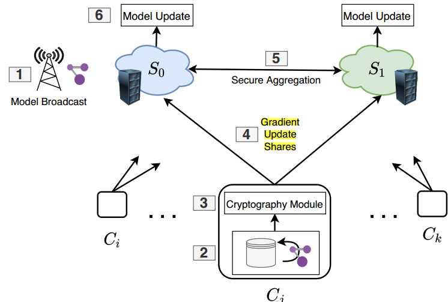
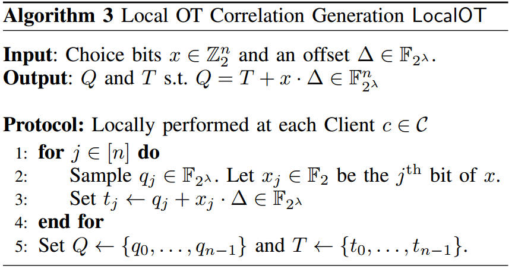
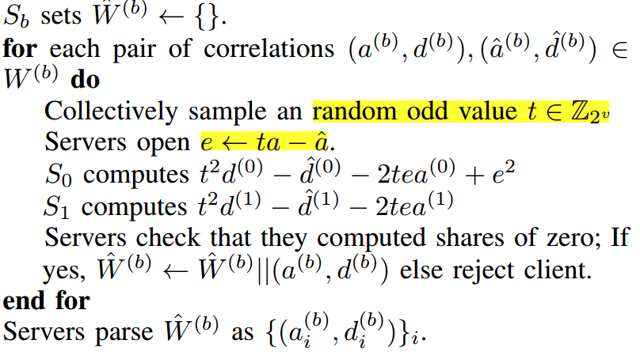
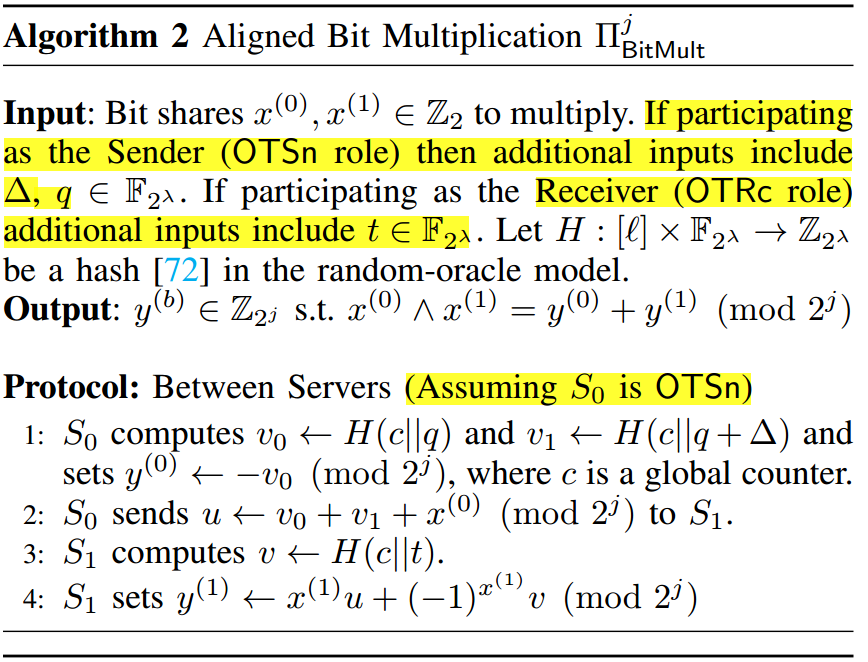
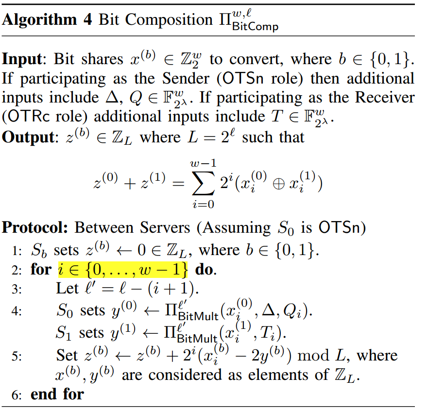
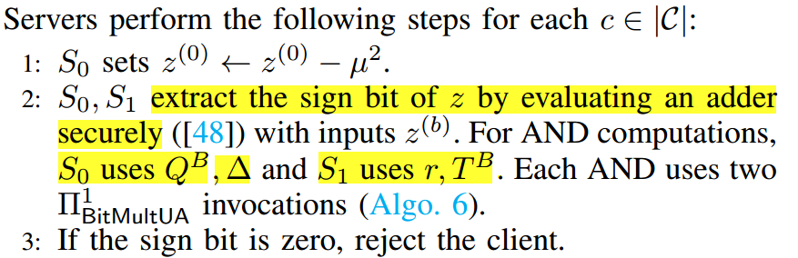

# ELSA: Secure Aggregation for Federated Learning with Malicious Actors

理想的特性：
- 与RoFL[34]、EIFFeL[40]和Prio[41]不能支持带宽受限的客户端不同，ELSA即使在客户端子集有严格的带宽约束时也能保持高效。
- 在ELSA中，一些恶意客户端无法阻止输出交付(RoFL缺乏此属性)，并且它可以承受客户端退出而不会导致运行时间下降(与[19,26,70,102]不同)。
- ELSA可以使用与输入无关的离线阶段来显著提高梯度可用时的端到端运行时间。
- 与许多单一聚合器先前的工作不同[19,26,40,70,102]，在我们的协议中，客户端不需要彼此交谈，这使得客户端的沟通更加简单
- 从客户机到服务器的通信是一次性的

### Building Blocks
协议支持$\mathbb{Z}_L$上的聚合，$L=2^l$
$x \overleftarrow{\$}\mathbb{Z}_L$表示从$\mathbb{Z}_L$中均匀随机抽样选取，$\lambda,\kappa$分别表示计算安全参数和统计安全参数。

### Design an Effient Protocol

OT选择IKNP技术，
比特合成和$l^2$计算是服务器服务器之间的通信随梯度更新的大小和参与客户端数量线性增长的两个阶段;所有其他阶段只需要这种通信的一小部分。$l^2$的计算更繁重，因为生成Beaver三元组非常昂贵，$l^2$通信成本由$m \cdot 2 \mu\cdot(\lambda + \mu)$主导，位(比特)组合需要$m \cdot \omega \cdot (\lambda+\mu)$位。其中$\mu$至少为$2 \omega + log \ m$。

---

**More effient sources of tripples and OTS**.
在服务器之间生成Beaver三元组使得$l^2$更昂贵，每个客户端都可以作为一个“不受信任的”(客户端可能是恶意的)三元组源，这些三元组对应于服务器为其梯度更新需要进行的$l^2$计算。由于$l^2$计算的可靠性依赖于这些三元组的正确性，因此服务器需要在使用它们之前首先对它们进行验证。为了验证，我们使用spdz2k[43]中著名的==牺牲技术==[43,45,73,74]，牺牲一个三重体来验证另一个三重体的正确性(统计上)。
客户端到服务器之间的通信可以降低到$2 m \mu$ bit，通过使用一个共享伪随机数生成器来生成$\alpha_i、\beta_i$的一个份额，确保$\gamma_i= \alpha_i \cdot \beta_i$成立。
让客户端生成Beaver三元组不仅使我们的协议显著提高效率，而且使它更简单(不需要OT扩展来生成三元组)。现在我们将这个想法扩展到位组合阶段使用的COTs。虽然与$l^2$计算不同，这不会大大提高我们的端到端协议的效率，但它仍然使它更简单，并且在增加客户端通信的同时进一步减少了服务器的通信和计算负载。我们默认采用这种安排是为了更好地跨各方分配工作，本节稍后将讨论带宽受限客户机的情况。

让客户端生成Beaver三元组不仅使我们的协议显著提高效率，而且使它更简单(不需要OT扩展来生成三元组)

---

- paper题目，期刊和年份
2023年，IEEE Symposium on Security and Privacy (SP), 2023

- 针对的是什么问题和安全需求是什么？
在训练数据集高度分布的情况下，联邦学习(FL，Fedreated Learning)是一种越来越流行的机器学习(ML，Machine Learning)方法。客户端对他们的数据集进行本地训练，然后将梯度更新上传到中央服务器，服务器进行梯度的安全聚合并更新全局模型，以此迭代。但是客户端上传的梯度输入可以遭到泄露，当然有可能存在恶意客户端上传恶意梯度(非常高的范数)来破坏全局模型，使得全局模型产生偏差。现有的聚合协议要么效率低下，要么没有考虑系统中恶意参与者的情况。这是使FL成为隐私敏感的ML应用程序的理想解决方案的主要障碍，本文将安全多方计算协议应用在联邦学习中，保护客户端梯度模型更新的隐私和过滤掉恶意的参与方的恶意或异常梯度。并且使用了轻量级验证协议来提高效率。

安全需求：
1、用户上传的梯度隐私：客户端提交的梯度会泄露其本地数据集的隐私信息，FL必须保护每个用户的梯度更新(用于全局聚合)。
2、恶意隐私：即使面对恶意客户端和最多一个恶意服务器之间的勾结，也能保证诚实客户端的梯度隐私。只要有一个服务器是诚实的，用户隐私就得到保证。
3、对放大的恶意梯度的鲁棒性：当存在恶意用户上传不正常的梯度时，系统应该识别出来并将其过滤掉增强梯度。
4、效率：服务器和客户端协议是轻量级的，实现高效的端到端安全FL，性能比之前工作要优。

- paper中阐述的国内外针对他这个问题的研究现状，并指出先前的工作中存在什么样的问题？然后需要这篇paper来解决。
  
在理想的FL场景下，FL允许客户保留他们数据的完全所有权，然而，客户机和服务器都有可能被对手破坏，导致对系统的一系列攻击[24,96,97]。多年来，大量的工作已经确定了对FL两种理想的安全属性：用户的梯度隐私和过滤掉恶意客户端的增强梯度。大多数现有的研究要么提供隐私[19,21,26]，要么保护不正常的梯度[22,37,84]。已经有人尝试同时实现这两种特性，但是大多数都效率低下，也有些只依赖于弱威胁模型。这些协议可以根据它们是否运行在单一聚合器模型中，其中中央服务器促进梯度聚合（RoFL[34]，EIFFel[40]等），或者它们是否将信任分配到两台单独信任域的服务器上。
**具有单个聚合器的FL**。该模型已被大量基于秘密共享、同态（homomorphic encyption）和功能加密（functional encryption）、差分隐私（differential privacy）或技术组合的隐私保护系统所采用。然而，这些工作不能防止恶意或不正常的梯度。零知识证明（Zero-Knowledge）已被建议[100]来加强范数防御，但开销过高。最近的工作RoFL[34]使用Bulletproofs[33]来强制执行$l_2^{\sqcap}$和$l_{\infin}$防御。EIFFel[40]的防御使用SNIPs(在Prio中证明[41])，其中所有客户端和中央服务器共同进行验证，然而这两种方法效率都很低。此外，其他既提供隐私保证又提供防御的研究要么假设了不现实的威胁模型[88]，要么在很大程度上是理论性的（并且泄露了成对梯度距离[101]）。联邦平均(Federate Averaging[83])是第一个与保护隐私的FL的方案，在随后的工作中[22,37,84,114]通过增加对畸形梯度的防御进行了改进。

**分布式信任的FL**。客户端将它们的全部信任分配到两个服务器上，两个服务器之间进行梯度的安全计算。在该模型中，现有的方法包括用于FL的专用系统[61]，以及用于保护汇总统计信息的隐私收集的系统，如Prio[41]和Prio+[13]，Prio使用专门的的零知识证明（SNIPs）来强制执行针对畸形梯度的任意防御，保证最多针对一个恶意服务器（两个服务器的情况下）的隐私。其余工作[13,61]只提供针对半诚实服务器的隐私，因此，还需要很多改进的地方。况且，Prio+[13]**在有恶意服务器存在时不能保证隐私**，恶意策略的一个示例是，OT消息中引入的消息作为秘密的函数传播，直接使用先前一些研究的恶意安全布尔到算术转换[44,51,93]的技术似乎很有希望，但这样的协议在通信上比半诚实的协议要贵一个数量级以上。Prio+主要构造背后的高级思想是让每个客户端将其梯度更新的布尔秘密共享发送到服务器，服务器使用共享的位长度作为代理来强制执行较弱形式的$l_{\infin}$防御。例如，可以通过允许位长度为3来现实更新中值的大小最多为7，这可以防止恶意客户端发送的畸形梯度。然后服务器使用OT(Oblivous Transfer)参与2-PC计算，将布尔共享转换为算数，以便聚合。一些较为先进的方案总结为下表。

| FL protocols | Efficient Parties| Malicious Privacy | Poisoning Resilence| Trust Modle|
| :-------:|:-----:|:--------:|:------:|:-----:|
|FedAvg[83]|$\surd$|&#x2716;|&#x2716;|$\circ$|
|SevAgg[26]|$\surd$|$\surd$|&#x2716;|$\circ$|
|Defence[37]|$\surd$|&#x2716;|$\surd$|$\circ$|
|RoFL[34]|&#x2716;|$\surd$|$\surd$|$\circ$|
|Prio[41]|&#x2716;|$\surd$|$\surd$|$\circ \ \bullet$|
|Prio+[13,64]|$\surd$|&#x2716;|$\surd$|$\circ \ \bullet$|
|ELSA(this work)|$\surd$|$\surd$|$\surd$|$\circ \ \bullet$|

Mallicions privacy指的是——即使面对恶意客户端和最多一个恶意服务器之间的勾结，诚实客户端的梯度也保持私有。Poisoning Resilence指的是对不正常梯度的防御，Efficient Parties指的是参与方之间的协议是高效的。

本文提出的ELSA相比以前的工作还有许多其他的特性，与RoFL[34]、EIFFel[40]和Prio[41]不能支持带宽受限的客户端不同，ELSA即使在客户端子集有严格的带宽约束时也能保持高效。ELSA可以使用与输入无关的离线阶段来显著提高梯度可用时的端到端运行时间。与许多单一聚合器的工作不同[19,26,40,70]，在ELSA协议中，客户端不需要彼此交流，这使得客户端通信更简单。此外，从客户机到服务器的通信是一次性的(单个消息)，之后客户机不需要在线。

- 考虑书本上的能否解决，书本上的思路有什么问题？
在上课过程中，我们学了OT、布尔分享、秘密分享和同态加密等安全多方计算技术，当然也提到了两方框架ABY-2PC，ABY是比较适合我们现在的安全模型的，即客户端将自己的私有向量提交给两个服务器，服务器之间执行一系列安全计算操作，例如要对梯度进行范数$l_2$防御，被定义为$\sqrt{x_1^2+x_2^2+\cdots+x_n^2}$，所以就涉及到一个数的平方，这可以用乘法三元组来实现，ABY中的乘法三元组是在两个服务器端用不高效的同态加密或OT来实现的，这也导致了通信轮次的增加，也让服务器之间的通信变得不高效。加上ABY中昂贵的混淆电路和OT协议，使得它并不能满足高效的要求。而且ABY本身也不支持恶意隐私，它仅针对半诚实客户端或服务器。

----

- paper中的解决思路是什么？

**基本思路(抵御恶意服务器)**。
首先是ELSA为了减少离线开销，优化在于优化乘法三元组和OT的相关性，让客户端去生成预计算的关联随机数(相关性)，提出了服务器对其进行准确的验证策略，需要验证的关联随机数包括基础OT生成的随机数和平方关联随机数；本文的验证策略大致是令两个服务器对OTs关联随机数进行随机线性组合+裁剪选择，以及使用SPDZ中的“牺牲技术”对客户端生成上传的平方关联乘法三元组进行验证，即验证一个三元组就牺牲一个三元组。
本文构建了一个提供恶意隐私的解决方案，基本上是免费的。依赖于两个重要的观察。首先，为了保证梯度的隐私性，我们只需要保护服务器在每个客户端的输入共享上执行的步骤，不包括最后一个聚合步骤(即所有客户端的梯度被加在一起)；我们称为“客户端特定步骤”，这是因为聚合步骤只允许不依赖于个人诚实梯度的加性错误[39]，因此不会影响隐私，其次，对于客户端$c$来说，事先知道服务器的内部状态对于$c$的“特定客户端步骤”即不会给它成功发起投毒攻击带来任何优势，也不会泄露任何关于其他客户端的梯度的信息。因此，每个客户端可以与服务器共享随机磁带，使服务器之间交换的消息完全确定，服务器发送的所有消息在客户端视图都是确定的，这使客户端能在本地生成服务器交互记录的摘要，并将其发送到服务器，帮助诚实的服务器捕获可能侵犯隐私的恶意行为。

**$l_2$防御的扩展**。与Prio+类似，目前的设计只支持松弛的$l_{\infin}$防御。一种更常用的防御方法是对梯度更新的$l_2$值施加上界。这可以使用乘法三元组（Beaver triples）来计算每个梯度向量内值的平方和来实现。由于在有限环上操作，为了保持稳健性，需要在每个梯度向量内配对一个分量的上限，在$l_2$计算中不能溢出。把这个增广的$l_2$防御叫做$l_2^{\sqcap} \ defense$。聚合协议是在$\mathbb{Z}_L$上进行的，其中$L=2^l$，对向量操作都是分量组件（component-wise）形式的。
为了说的更明白一些，对于一个向量$(x_1,x_2,\cdots,x_n)$，$l_2^{\sqcap}$由附加的$l_{\sqcap}$和原始的$l_2$组成，$l^{\sqcap} \ bound$允许向量中的一个分量值最多为$2^{\omega}-1$（每个布尔分享值得比特位$\leq \omega$），$l_2$是可靠的只要$l_{\sqcap}$满足$n \cdot (l_{\sqcap})^2 \leq L'$(没有溢出)，其中$L'$是$l_2\ computation$下的环模。在我们的$l_2^{\sqcap}$防御下，我们选择一个大的$l_{\sqcap}$($L'$可以适当调整)来为诚实梯度留下足够得余量空间，将它设置为接近$l_2 \ bound(eg. \ \mu)$是理想的，因为$l_2$规范显示限制了向量中的每个值最多为$\mu$。而且，我们使用$l_2^2 \ bound$（范数边界）为$\mu ^2$，但是为了简要表示为$l_2$。为了计算$l_2$的值，服务器首先将布尔份额转换为算术共享，然后使用乘法三元组来计算$l_2$的份额。 

**利用廉价、不可信的随机性**。为了使点对点的协议更高效，本文将客户端作为服务器所需的加密材料（相关性）的廉价不可信来源，这样服务器就省去了使用昂贵的2PC交互生成这些材料。客户都只是对一些受简单约束的随机数进行采样，然后将这些关联随机数(correaltions，相关性)发送给服务器，就可以在服务器之间秘密共享，从而提高性能。相关性指的是一些需要预计算的随机数，可以用于验证OT和乘法三元组、位组合、$l_2$计算和检测边界，服务器端需要验证的关联随机数包括：
- 基础OT生成的随机数；(COT，关联OT)
- 平方关联随机数

但是不能信任恶意客户机生成正确的关联，因此服务器需要**一种有效的方法来验证这些关联**。在协议中，服务器需要OT关联来进行布尔到算术的转换，需要Beaver三元组来计算$l_2$份额，使用SPDZ牺牲技术[43]来验证乘法三元组，大大减少服务器的总通信和工作负载，唯一的缺点是客户机之间的通信增加，<u>因此本文让带宽受限的客户机单独选择退出此优化，让服务器来生成这些客户机的相关性，并且仍然在很大程度上保持端到端效率</u>。

</img>

ELSA中的客户端可以是移动设备或大型组织的用户，他们有个性化的数据集，他们不想向任何人透露，服务器希望在这个大型分布式数据集上训练ML模型。ELSA-FL管道。$S_0,S_1$表示不同信任域中的服务器，每个服务器都持有当前全局模型的副本。$C_i$表示在使用其加密模块启用安全聚合之前执行本地训练的第$i$个客户端。方框中的数字表示步骤。

### ELSA Secure Fedreated Learning

**说明**  $S_b,b \in \{0,1\}$代表服务器，参与的客户端$\mathcal{C}$表示为集合$\{0,1,\cdots,n-1\}$，要上传的输入向量$\{x_0,x_1,\cdots,x_{n-1}\}$表示为$\{x_i\}_{i=0}^{n-1}$，简示为$\{x_i\}_i$，$\tau$表示每轮中被聚合梯度的客户端的最小序号。协议支持$\mathbb{Z}_L,L=2^l$上的聚合。文中使用的是IKNO OT extension。

**更高效的三元组和OTs的来源**
本文不在服务器之间生成乘法三元组和OTs的相关性，而是让客户端在本地生成“不受信任的”的相关性，服务器再进行两方验证。对于$m$个元素的梯度更新向量，每个客户端准备$2m$个三元组并在服务器之间秘密共享，由于是求平方，客户端只需要发送$(a_i,d_i),d_i=a_i^2$的分享给两个服务器，将客户端发送给服务器的通信大小从$6m\mu$位降低到$2m\mu$，服务器使用著名的SPD$\mathbb{Z}_{2^k}$中的牺牲技术[43]，牺牲一个三元组来验证另一个三元组的正确性，所以客户端才生成了输入维度的两倍大小的三元组。

整个协议大致分为以下步骤：
Input: 向量大小为$m$，设$n=m\cdot \omega+2\mu+\lambda+\kappa$，对于$l_2^{\sqcap}$防御，$\mu$和$2^{\omega}-1$分别是$l_2$和$l_{\sqcap}$的执行边界。假设$S_0$是发送方OTSn，$S_1$是接收方OTRc。
Output：具有$m$个值的全局聚合，其中跨客户端的向量组合$\omega$在$\mathbb{Z}_L$上聚合。
1、输入分享阶段（客户端本地）：
每个客户端$c \in \mathcal{C}$生成输入$x$的分享$x^{(0)},x^{(1)}$，并发送给服务器。$x \in \mathbb{Z}_2^{m \times \omega}$，其中$m$是向量维度，$\omega$是每个元素的比特长度。
2、OT生成阶段（客户端本地）：
- 每个客户端采样$\Delta \in \mathbb{F}_{2^{\lambda}}$和$r \in \mathbb{Z}_2^{2\mu+\lambda+\kappa}$。
- 每个客户端使用LocalOT生成OT相关性$Q,T$和$Q',T'$，将$x^{(1)}$展平：
  $$(Q,T) \leftarrow LocalOT(x^{(1)},\Delta);
  (Q',T') \leftarrow LocalOT(r,\Delta)
  $$
- 每个客户端发送$\Delta$和$Q=(Q||Q')$给$S_0$(OTSn)，$r$和$T=(T||T')$给$S_1$。

LocalOT如图所示，最终输出满足的性质为$Q=T+x^{(1)}\cdot \Delta$和$Q'=T'+r\cdot \Delta$。这些相关性可以用于服务器来进行布尔转算术共享和比特组合，服务器也可以进行相关的OT验证。

3、平方关联生成（客户端本地）：
- 设$v \leftarrow \mu + \kappa+3$
- 每个客户端$c \in \mathcal{C}$随机抽样$\{a_i\}_{i=1}^{2m} \in \mathbb{Z}_{2^v}$。
- 每个客户端生成$\{a_i,d_i\}_{i=1}^{2m}$的算术分享$W^{(0)},W^{(1)}$，其中$d_i=a_i^2 \pmod 2^v$，并发送给相应的服务器。

4、OT验证（服务器两方）
服务器对每个客户端$c \in \mathcal{C}$执行以下步骤：
- $S_0,S_1$共同抽样随机数$\{\mathcal{X}_1,\mathcal{X}_2,\cdots,\mathcal{X}_n\} \in \mathbb{F}_{2^{\lambda}}^n$，$S_1$(OTRc server)解析$\widehat{x} \leftarrow (x^{(1)}||r) \in \mathbb{F}_2^n$计算：
$$\widehat{x} = \sum_{j=1}^n \widehat{x}_j \cdot\mathcal{X}_j; \ \ \widehat{t}=\sum_{j=1}^nT_j \cdot \mathcal{X}_j$$
- $S_1$发送$\widehat{x}, \widehat{t}$给$S_0$，$S_0$计算：
$$\widehat{q} = \sum_{j=1}^n Q_j \cdot \mathcal{X}_j$$
- $S_0$检查是否$\widehat{t} = \widehat{q} + \widehat{x}\cdot\Delta$成立，如果不成立拒绝客户端提交的OT-correlations。
- $S_0,S_1$丢弃最后$\lambda+\kappa$个OT关联，进一步将剩余的相关性分成两部分$(Q^A,T^A)$和$(Q^B,T^B)$，第一组每个长度为$m\cdot \omega$，把$Q^A,T^A$变成折叠形式$\in \mathbb{F}_{2^{\lambda}}^{m\times \omega}$。

5、平方关联验证（服务器两方）
服务器对每个客户端$c \in \mathcal{C}$执行以下步骤：

从流程中可以看出服务器首先设置了$\widehat{W}^{(b)}$为空，每验证一对三元组需要两对三元组的配合，如果两个都是对的，那么选取第一对作为新的$\widehat{W}^{(b)}$，直到满足我们的需求（牺牲技术的思想），正确性为$S_0$和$S_1$计算的值加和为0。
$$
\begin{align*}
 & t^2d^{(0)}-\widehat{d}^{(0)}-2t(ta-\widehat{a})a^{(0)}+(ta-\widehat{a})^2+t^2d^{(1)}-\widehat{d}^{(1)}-2t(ta-\widehat{a})a^{(1)} \\
& =t^2(d^{(0)}+d^{(1)})-(\widehat{d}^{(0)}+\widehat{d}^{(1)})-2t(ta-\widehat{a})(a^{(0)}+a^{(1)})+t^2a^2+\widehat{a}^2-2ta\widehat{a} \\
& = t^2a^2-\widehat{a}^2-2t(ta-\widehat{a})a+t^2a^2+\widehat{a}^2-2ta\widehat{a} \\
& =2t^2a^2-2t^2a^2+2t\widehat{a}a-2t\widehat{a}a \\
& =0
\end{align*}
$$

6、比特组合阶段（服务器两方）
本阶段是将服务器上的布尔分享值转换为算术分享，以便后面计算$l_2$的值。
在此之前先引入两个算法$\prod_{BitMult}^j$和$\prod_{BitComp}^l$，如图所示。$\prod_{BitMult}^j$算法是为了将布尔分享转成算术分享的一个子协议，它最后输出的是$y^{(0)}$和$y^{(1)}$在两个服务器之间分享且满足$x^{(0)} \wedge x^{(0)} = y^{(0)} + y^{(1)}$。前提条件是$x = x^{(0)} \oplus x^{(1)} = x^{(0)} + x^{(1)} - 2(x^{(0)} \wedge x^{(1)})$，这样就将布尔分享转成算术上的加减运算了。

$\prod_{BitComp}^l$算法是对某个单独的数进行处理，将分享在两个服务器上的比特按位进行组合即$z=\sum_{i=0}^{\omega-1}2^i\cdot x$，最终满足$z=z^{(0)}+z^{(1)}$，在两个服务器之间共享。
有个上面两个算法，服务器在每个客户端执行以下步骤：

对于每个向量中的元素值，下标为$i \in m$：
$S_0$ 设置$z_i^{(0)}= \prod_{BitComp}^{\omega,\mu}(x_i^{(0)},\Delta,Q_i^A)$
$S_1$ 设置$z_i^{(1)}= \prod_{BitComp}^{\omega,\mu}(x_i^{(1)},T_i^A)$
此时$x_i = z_i^{(0)}+z_i^{(1)}$

7、$l_2$计算阶段（两方服务器之间）：
本阶段是计算每个客户端提交向量的$l^2$值，即每个元素的平方和。
服务器对每个客户端$c \in \mathcal{C}$执行以下步骤：
$S_b$设$z^{(b)}=0 \in \mathbb{Z}_{z^u},b \in \{0,1\}$，
对于每个向量中的元素值，下标为$i \in m$：
服务器公开$e = z_i - a_i$,
$S_0$计算$z^{(0)}=z^{(0)}+d^{(0)}+2ez_i^{(0)}-e^2 \pmod {2^u}$
$S_1$计算$z^{(1)}=z^{(1)}+d^{(1)}+2ez_i^{(1)}\pmod {2^u}$
此时满足$x_i^2 = z^{(0)}+z^{(1)}, i \in [m]$，并由$S_b$两方服务器共享。

8、$l_2 \ enforcement$执行阶段(两方服务器之间)：
此阶段的目的是检测最后的$l_2$值是否小于$\mu^2$，两方分别计算$z^{(0)}=z^{(0)}-\mu^2$，此时即获得了$y-\mu^2$的两个算数共享，通过安全加法器[48]提取其最高有效位(MSB)；安全加法器可以使用COTs计算，每个AND门需要两个$\binom{2}{1}-COT_1$，加法器输出和的布尔份额，然后打开MSB以显示输出，零意味着边界违反。

### 怎么实现恶意隐私以及优化？
与半诚实服务器不同，恶意服务器可以发送格式错误的协议消息来侵犯个人梯度的隐私。例如，考虑对齐位乘法(算法2)，其中$S_0$是恶意的,为了保证隐私，我们要求$S_0$不知道$S_1$持有的比特$x^{(1)}$。由于恶意的$S_0$可以发送畸形消息，因此它可以将其消息构造为$u←v_0 + v_1 + x ^{(0)} + δ$，其中$δ$是它引入的一些错误。只有当$x^{(1)}$为1时$δ$才会对最终的聚合有贡献因为只有当$u$被$S_1$使用时。因此，最终结果(向两个服务器打开)显示$x^{(1)}$到$S_0$。这只是恶意服务器可能危及梯度隐私的一种方式。我们需要消除这些攻击，以达到我们恶意保护隐私的目标。前面提到过，最后的聚合步骤是不需要恶意安全的步骤，因为它只允许梯度的加性错误，并不会影响隐私，也就是说当服务器是恶意时，不能保证聚合结果的正确性。
观察到，当客户端向服务器提供OT和平方关联时，服务器协议中除了OT和平方关联验证之外的所有隐私敏感步骤都可以由客户端本地生成，因为不涉及外部随机性（布尔分享来自客户端）。OT和平方相关性验证依赖于由服务器生成的随机挑战（如OT验证中的随机数列$\{\mathcal{X}_1,\mathcal{X}_2,\cdots,\mathcal{X}_n\}$，平方关联验证中的随机数$t$）。本文的一个思路是服务器对每个客户端启动一个实例来实施$l^{\sqcap}_2$防御，只要我们能够保证对于每个实例，对应的客户端能够先验地知道服务器之间相互发送的所有消息，这并不影响$l^{\sqcap}_2$防御的可靠性，对于每个实例，我们让相应的客户机模拟服务器交互的整个记录，并将其发送到两个服务器。诚实服务器现在可以在与另一个服务器交互时根据来自客户端的记录交叉检查它所观察到的记录，并轻松检测恶意篡改。如果检测到篡改，我们停止对有关客户端输入的任何进一步处理(审查客户端)，以维护他们的隐私，并继续执行协议的其余部分。如果被审查的客户端比例超过配置的阈值$τ$(例如，除了一个客户端外，所有客户端都被审查)，诚实服务器将终止协议。在OT和平方关联验证中，服务器生成了一些随机数，叫做“随机挑战”，在客户端提交相关性之前对客户端隐藏这些信息。因此，本文将客户端协议分成两轮——在第一轮中，客户端向服务器发送布尔共享和加密关联，在接收到服务器的随机挑战后，在第二轮中，客户端发送服务器-服务器交互的所有步骤的记录，除了最后的聚合阶段。

**优化？**
**One-Show Clients（一次性客户端）**。这里使得客户端协议优化为一轮，验证阶段依赖于客户端不知道服务器抽样的随机挑战。一旦客户端已经提交了相关性，就不再需要隐藏随机挑战。如果客户端可以在不破坏验证阶段的合理性的情况下在本地生成随机挑战，那么我们就得到了一次性客户端。OT验证中的随机挑战是$\mathcal{X}_i$值，这些值通过调用coin-flip协议由$S_0,S_1$共同采样。当使用带有哈希函数$H:\{0,1\}→\mathbb{F}_{2^λ}$的Fiat-Shamir变换时，定义$χ←H(χ ^{(0)}， χ^{(1)})$，其中$χ(b)←H(b, x^{(b)}， p, q, W^{(b)}， θ_b)$， $θ_b$是由客户端采样的一个盲变量(并传达给$S-b$)，以确保$χ^{(b)}$不会将$S_b$的份额信息泄露给$S_{1 - b}$，如果b为零，则$(p, q)←(∆，q)$，否则为$(r, T)$。然后，服务器可以在本地生成$χ ^{(b)}$并与其他服务器共享以获得种子$χ$，然后使用PRG对其进行扩展以产生$\{χ_i\}_i$。使用此转换后，服务器不再需要掷硬币子协议来采样$\{χ_i\}_i$。

---

- 最终效果是什么，安全性分析或性能分析结果

**实现**。我们在Rust中实现了ELSA，并在https://github.com/ucbsky/ ELSA上公开了我们的代码。为了处理大量同时发生的客户端会话，我们使用Tokio[6]作为我们的通信后端。对于有限域乘法，我们采用Keller等人[72]和EMP Toolkit[7]的优化方法。我们使用miTCCR[59]作为我们的哈希函数，并使用硬件加速的AES用于PRG。当需要在服务器之间生成OT时(在Prio+中，对于ELSA中带宽受限的客户端)，我们使用IKNP [68] OT扩展。我们的大部分评估不包括一次性客户端优化，因为它对性能的影响几乎可以忽略不计。

**实验设置**。为了模拟每个客户端与服务器打开单独连接的实际场景，我们实现了一个元客户端;它为每个客户端打开独立的连接，并确保为每个连接分配的带宽保持合理。我们在r5n上部署元客户端。16xlarge AWS实例(俄亥俄州)，64个vcpu，两个r5.8xlarge实例(俄亥俄州和北弗吉尼亚)上的服务器，32个vcpu和10Gbps带宽。在计算能力和带宽方面，这与RoFL的设置非常相似。用t2.medium评估单个客户机的计算开销时间。在整个实验中，服务器时间是在客户机的所有通信完成后测量的。除非另有说明，我们将梯度中的单个值考虑为32位，并在64位上进行聚合和计算，即$w = 32, r = u = 64, v = 128和\kappa = 61$。

**与分布式基线实验的比较**，我们用rust建立Prio并合并到文中的框架中，实现与ELSA类似的多线程功能。由于它不支持$l_2^{\sqcap}$防御，我们与它的松弛$l_{\infin}$防御与$l_{\sqcap}$进行对比。表中显示了比较的结果。
ELSA中的服务器运行时间比Prio快了8.5~16倍，客户端运行时间快了2~3.6倍，而总运行时间则提高了8倍。当每轮选择更多的客户端时，客户端的运行时间会增加。在通信方面，ELSA中的每个客户端都比Prio通信少一点，但与我们的协议相比，Prio中的服务器通信可以忽略不计(他们的证明的工件)。另一方面，ELSA与Prio的总通信量(包括所有客户端和服务器)仍与ELSA的通信量相当，约为Prio的1.5倍。

与单一聚合器的比较。接下来与RoFL进行比较，RoFL是最先进的单聚合器FL协议，RoFL支持$l_2^{\sqcap}$防御，但不支持恶意隐私，表3显示了三个参数大小的比较，每个参数大小对应一个由RoFL评估的网络。CIFAR-10 S和CIFAR10 L分别对应于在CIFAR-10[77]上训练的LeNet5[80]和ResNet-18[63]，而SHAKESPEARE是在SHAKESPEARE数据集[36]上训练的LSTM[65]。我们实现了146-305倍的端到端运行时改进，同时产生与RoFL相同的总通信。在RoFL中，所有通信都是从客户端到服务器，ELSA中的客户端通信比RoFL低1.6~1.8倍。

**ELSA的性能**
本节我们将研究协议的不同部分如何影响性能。首先，我们考虑了协议级的成本，从我们的基础协议开始，它只对半诚实的服务器提供隐私，并强制执行$l_{\sqcap}$边界，直到我们的恶意私有协议具有$l_2$边界;称之为分层成本。其次，我们将深入研究协议的不同阶段如何影响端到端运行时间。

**分层成本**。我们称我们的第一层为“ELSA SH $l_{\sqcap}$”，它与Prio+非常相似，不同之处在于ot都是由客户端提供的并且在服务器使用它们做比特组合前进行验证。第二层是ELSA SH $l_2^{\sqcap}$对于半诚实隐私，第三层是ELSA SH $l_2^{\sqcap}$对于恶意隐私，我们在图2中给出了这些层的运行时间和通信成本。当客户端数量很大(例如，200)并且梯度适中(例如，200k)时，即使我们的防御包含了他们的防御并防御更强大的恶意服务器，我们的端到端恶意隐私和$l_2^{\sqcap}$防御的运行时也可以与Prio+相媲美;并且我们观察到，对于从客户端通信的相同数据量，更多的客户端每个发送更少的数据比翻转情况更快(这对客户端通信已经很小的Prio+没有好处)。

对于恶意隐私，增加的开销非常小，仅占半诚实运行时的7~25%，因为它可以承受更强的恶意破坏。在通信方面,我们的第一层协议和Prio+有相同的总通信,和SH $l_2^{\sqcap}$层产生额外的成本约为14%。对于恶意隐私，由于我们对记录摘要进行了优化，因此总通信的额外开销可以忽略不计。请注意，尽管Prio+可以使用基于PCG的OT扩展[30,31,112]后端实例化，以使总通信(以更多的计算为代价)减少到IKNP后端的三分之一左右，ELSA也可以在PCG模式下使用，以在总通信中享受类似的好处。此外，在PCG模式下，ELSA的客户端通信与Prio+相当。我们将这种模式的实验评估留给未来的工作。我们还比较了使用和不使用一次性客户端的协议的运行时。对于200k个参数和200个客户端(恶意隐私和$l_2^{\sqcap}$)，客户端运行时间从19秒(两轮客户端)变化到17秒(一次性)，服务器运行时间从14秒变化到19秒。

**带宽受限的客户端**
我们的工作通过将相关随机性的生成转移到服务器来支持带宽受限的客户端。现在，我们将以此类客户的比例及其约束程度为函数，展示此策略如何影响我们的性能。

在中等带宽限制下，客户机有足够的带宽通过发送方形关联来帮助服务器，并且与常规客户机相比，通过不发送OT关联可以节省通信。对于我们在评估中考虑的环，这相当于受限客户端的带宽需求减少了16倍。考虑到如此显著的节省，大多数(如果不是全部)受限的客户机应该能够满足这种情况的需求。图4显示，端到端运行时和服务器通信随着带宽适度受限的客户端比例的增加而增长非常缓慢。当10%受到限制时，时间和服务器通信分别仅增加5%和15%。即使在假设的情况下，服务器通信增加小于2倍，总运行时间小于1.3倍，在这种情况下，协议保持了其效率保证。

当客户端带宽极度受限时，协议不要求它们向服务器发送任何关联，因此与我们考虑的环的常规客户端相比，带宽减少了137x。从图4中，我们观察到，在这种情况下，增加受约束客户机的比例对运行时和服务器通信的影响要明显得多。如果10%的客户端属于这一类，端到端运行时和服务器通信都将增加约2倍，当一半的客户端受到约束时(极不可能)，运行时的通信将增加3倍，通信将增加6倍。

